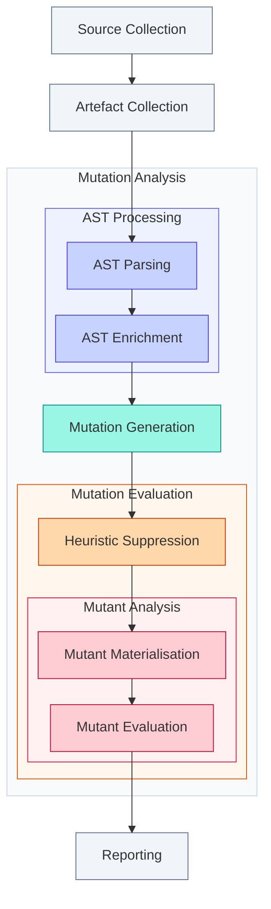

# Nomenclature

## Table of Contents

- [Execution Phases](#execution-phases)
- Index
    - [A](#a)
        - [Arid Node][arid-node]
        - [Artefact Collection][artefact-collection]
        - [AST][ast]
        - [AST Enrichment][ast-enrichment]
        - [AST Parsing][ast-parsing]
        - [AST Processing][ast-processing]
    - [E](#e)
        - [Eligible Node][eligible-node]
    - [H](#h)
        - [Heuristic Suppression][heuristic-suppression]
    - [M](#m)
        - [Mutagenesis][mutagenesis]
        - [Mutant][mutant]
        - [Mutant Analysis][mutant-analysis]
        - [Mutant Evaluation][mutant-evaluation]
        - [Mutant Materialisation][mutant-materialisation]
        - [Mutation][mutation]
        - [Mutation Analysis][mutation-analysis]
        - [Mutation Generation][mutation-generation]
        - [Mutator][mutator]
    - [R](#r)
        - [Reporting][reporting]
    - [S](#s)
        - [Source Collection][source-collection]
        - [Subject][subject]
    - [T](#t)
        - [Tracer][tracer]
        - [Trace][trace]
- [References](#references)

## Execution Phases

The following diagram shows how the execution phases relate to one another:

## A

### Arid Node

An [AST][ast] node that, if mutated, would create unproductive [mutants][mutant]. Examples include
calls to memory-reserving functions. [\[1\]][ref-1]

### Artefact Collection

The gathering of prerequisites such as coverage reports or cache files. This typically involves either validating
provided artefacts or running the initial test suite.

### AST

Acronym for [Abstract Syntax Tree][ast-definition]. A tree representation of the abstract
syntactic structure of source code. Infection parses source files into this representation to perform mutations.

### AST Enrichment

The traversal of the [AST][ast] to add context, mark [arid nodes][arid-node], identify [eligible nodes][eligible-node], and similar preparatory tasks.

### AST Parsing

The creation of an [AST][ast] for each source file.

### AST Processing

The building and enriching of the program representation. Encompasses [AST parsing][ast-parsing] and
[AST enrichment][ast-enrichment].

## E

### Eligible Node

An [AST][ast] node for which a [mutation][mutation] can be generated. [\[1\]][ref-1]

## H

### Heuristic Suppression

The application of heuristics to filter out mutations unlikely to provide value. Suppressed mutations bypass
[mutant materialisation][mutant-materialisation] and [mutant evaluation][mutant-evaluation]. [\[1\]][ref-1]

## M

### Mutagenesis

The process of creating a [mutant][mutant] from the original program. [\[2\]][ref-2]

### Mutant

A program that differs from the original by having a [mutation][mutation] applied. [\[3\]][ref-3]

### Mutant Analysis

The phase encompassing [mutant materialisation][mutant-materialisation] and [mutant evaluation][mutant-evaluation].

### Mutant Evaluation

The execution of tests against the mutant process(es) and recording of the outcome.

### Mutant Materialisation

The writing of mutated code to disc and spawning of an isolated process in which the mutation is applied.

### Mutation

The result of applying a [mutator][mutator] to a representation of a [subject][subject] (e.g. AST, bytecode), representing a change to be applied. [\[3\]][ref-3]

In the mutation testing literature, the terms "mutant" and "mutation" are often used interchangeably, as both refer to the change being introduced.

### Mutation Analysis

The core mutation testing cycle: generate, filter, instantiate, evaluate. Encompasses
[mutation generation][mutation-generation], [heuristic suppression][heuristic-suppression],
[mutant materialisation][mutant-materialisation] and [mutant evaluation][mutant-evaluation]. [\[3\]][ref-3]

### Mutation Generation

The traversal of the [AST][ast] to yield [mutations][mutation] for each [eligible node][eligible-node].

### Mutator

A definition of a possible transformation which, when applied to the [AST][ast] of a [subject][subject], produces a [mutation][mutation]. [\[2\]][ref-2]

In the mutation testing literature, mutators are also known as "mutant operator", "mutagenic operator", "mutagen", and "mutation rule".

## R

### Reporting

The generation of a report summarising the execution results.

## S

### Source Collection

The identification and collection of source files to mutate.

### Subject

An addressable piece of code to be targeted for mutation testing.

## T

### Tracer

A tool responsible for establishing a binding, a [_trace_][trace], between a piece of source code and the
tests that execute it. A tracer may work unidirectionally (i.e. finding the corresponding tests for
a given piece of source code), bidirectionally, or in reverse.

### Trace

An artefact produced by a [tracer][tracer], associating a piece of source code with its corresponding tests.

## References

_Note: These references indicate where a term is used or defined, not necessarily the original source that coined it._

1. Goran Petrović, Marko Ivanković, Gordon Fraser, and René Just, "Practical Mutation Testing at Scale: A view from Google," _IEEE Trans. Softw. Eng._, vol. 48, no. 10, pp. 3900–3912, Oct. 2022, doi: [10.1109/TSE.2021.3107634](https://doi.org/10.1109/TSE.2021.3107634).
2. Yue Jia and Mark Harman, "An Analysis and Survey of the Development of Mutation Testing," _IEEE Trans. Softw. Eng._, vol. 37, no. 5, pp. 649–678, Sep. 2011, doi: [10.1109/TSE.2010.62](https://doi.org/10.1109/TSE.2010.62).
3. Richard A. DeMillo, Richard J. Lipton, and Frederick G. Sayward, "Hints on Test Data Selection: Help for the Practicing Programmer," _Computer_, vol. 11, no. 4, pp. 34–41, Apr. 1978, doi: [10.1109/C-M.1978.218136](https://doi.org/10.1109/C-M.1978.218136).

[arid-node]: #arid-node
[artefact-collection]: #artefact-collection
[ast]: #ast
[ast-definition]: https://en.wikipedia.org/wiki/Abstract_syntax_tree
[ast-enrichment]: #ast-enrichment
[ast-processing]: #ast-processing
[eligible-node]: #eligible-node
[heuristic-suppression]: #heuristic-suppression
[mutagenesis]: #mutagenesis
[mutant]: #mutant
[mutant-analysis]: #mutant-analysis
[mutant-evaluation]: #mutant-evaluation
[mutation-generation]: #mutation-generation
[mutant-materialisation]: #mutant-materialisation
[mutation]: #mutation
[mutation-analysis]: #mutation-analysis
[mutator]: #mutator
[ast-parsing]: #ast-parsing
[ref-1]: #references
[ref-2]: #references
[ref-3]: #references
[reporting]: #reporting
[source-collection]: #source-collection
[subject]: #subject
[tracer]: #tracer
[trace]: #trace
