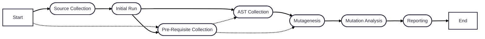

# Mutation Testing

The mutation testing service:

Note that this document will use the terms "mutation operator" and "mutator" interchangeably. They are strictly
synonyms.

**TODO**: "mutation testing service" or "mutation testing engine"?
**TODO**: is there an academic distinction between equivalent and redundant mutants?



## Source Collection

The source collection refers to the process of collecting the data the service is going to operate on.

The service can operate on what is defined as the known source code. In Infection, this is `infection.json5#source`. The
service can be executed against the entire codebase or on a subset.

Additional filtering is available which will narrow down the source:

1. A git-based changelist. In infection this is currently done via `--git-diff-*`
   options.
2. A selection of files. In infection this is currently done via `--filter`
3. A selection of symbols: classes, functions and/or methods.

**TODO**s:

- For git-based options: maybe could clarify which ones are really needed, and maybe a more sensible default could be
  provided. Maybe in the CI it could detect what the target is automatically too, and otherwise, if not in the CI, could
  do based on all the uncommitted files or smth. To further discuss.
- To review the naming of `--filter` and its possible values/format.
- Need to further define 3).
- We should be able to easily show the list of affected files and/or symbols. This likely
  needs to be a dedicated command as otherwise this may be too verbose and confusing.
  Indeed, the actual source used in the end may be different based on additional filters... Currently, this would be
  only about listing the files considered, without considering the test coverage report for instance, which could allow
  us to avoid some files. Another scenario is if we allow to select symbols, maybe we would want to be able to list the
  symbols...

## Pre-Requisite Collection

To operate efficiently, the mutation testing service requires some data. The nature of the data varies depending on the
implementation and underlying tool(s) used.

In Infection, this will be a JUnit + XML PHPUnit code coverage report for PHPUnit. If PHPStan is used, this will include
an up-to-date PHPStan cache. From those artefacts, we generate _traces_. A trace is a way to identify what test to
execute for a given piece of code.

This data is expected to be provided by the user. In which case it needs to be validated to ensure up-to-date data is
being used. But to provide a better user experience, the mutation testing service can do an "initial run" to generate
this data.

**TODO**s:

- currently, Infection does not guard against using outdated data.
- Infection should offer some commands to be able to validate the artefacts
- Maybe mention tracing?

## Initial Run

The initial run helps to provide a better user experience by executing the initial services (tests, static analysis
tools, etc.) to:

1. Make sure the code is valid before any modification.
2. Collect the pre-requisite data.

This step is **needed* if the pre-requisite data is not provided, but otherwise it can be skipped, although dangerous.
In Infection, this can be done via the `--skip-initial-tests` option.

**TODO**: Infection should offer a command to execute the various testing tools without any mutation (for debugging
purposes).

## AST Collection

The goal of this step is to collect a rich eligible AST. A node is defined as eligible if it can be mutated. The AST can
be enriched with additional information to facilitate the creation of mutations at a later time.

This works by:

- Parsing the provided source files
- Label the code as non-eligible if it is not part of the desired source. For instance, if only a piece of code has been
  changed in the file and the service is being executed in incremental/targeted mode *1, then not all AST nodes from
  this file are eligible.
- If a node is not being covered by at least one test, it should not be eligible (depending on the tracing strategy).
- Label the code explicitly ignored by the user as non-eligible. *2
- Detect and label arid code *3. Examples:
    - Memory allocation statements (not application to PHP).
    - STDOUT/logging
    - memoization/cache allocation
    - time-sensitive calls
    - random number generation
    - ...?
- Collect and provide additional context to the nodes. *4

*1: See mode 2) and 3) from [specific symbol](#source-collection).

*2: Currently code can be ignored by Infection via the `@infection-ignore-all` annotation in the code and
`infection.json5#mutators.global-ignoreSourceCodeByRegex`. Note that this should only apply for code being ignored for *
*all** mutators.

*3: Currently not done by Infection. Should be implemented by making the weight of those nodes lower (a lower weight
translates to a lower interest). This is a part that could have an extension point in the future and for instance to
allow a hosting service to curate its data and what nodes to label as arid.

*4: An existing use code for Infection is to collect the name of the methods being called in different context for the
`PublicVisibility` mutator to be smarter about the mutations it issues. Another potential case would be to collect the
symbols that are being inspected to retrieve additional information. For instance if we need to call PHPStan or other to
get the extra types, it would be better to do so now rather than when evaluating each mutation. That said if a single
call to PHPStan can provide multiple types, we could do this in a lazy and smart way to avoid doing it if it proved
unnecessary. Likewise, defining what information needs to be collected could be affected by the mutation operators being
used. If `PublicVisibility` is disabled, we to do need to collect the methods being called. This implies that a Mutator
should have a way to communicate what "additional info" it needs.

**TODO**s:

- There should be a way to see why Infection ignores a piece of code.
- I believe excluding the code may not be done at the correct place yet.
- All the labelling could follow a coding system to be able to identify the reason for easier review/debugging. For
  instance, a node could be labelled as non-eligible because it is not part of the targeted source, or it cannot be
  traced to a test (both different reasons so different codes).
- If SA or other testing tools are allowed, or based on the tracing strategy, maybe requiring at least one test/trace is
  not correct.

## Mutagenesis

The mutagenesis service navigates the AST and provides potential mutants. It has access to a registry of mutation
operators (AKA mutators) which is implemented as AST visitors.

A few additional notes:

- Some mutators may be disabled in which cased they are not included in the mutagenesis registry.
- The mutagenesis strategy employed.

### Mutagenesis strategies

There are multiple different ways to approach the problem.

The naivest approach is to generate all the possible mutations and then execute the analysis on the entire collection.
This offers the tremendous advantage of having more performant heuristics in the mutation analysis (e.g., to have higher
order redundant mutant detection) or to have a more accurate mutation selection strategy. Indeed, if a node has 10
potential mutations, it is easier to know which mutation to evaluate first or which ones to select, as the list of
mutations and their weights is known ahead of time.

Another approach which is used at Google for scalability reasons is to have a selection strategy which will pick which
mutator to use and directly evaluate the produced mutations. If the mutant is detected, hence the code point is covered,
no further mutation is requested. Otherwise, an additional one is requested and the cycle repeats until the limit is
reached.
Google uses two selection modes: a *random* selection, which selects a mutator at random, and a *targeted* selection
where the decision is done based on the historic performances of the mutator.

**TODO**s:

- It should be possible to see what mutators are enabled/disabled.
- Based on the level of strictness requested (not implemented yet in Infection), a mutator which can have an inherent
  weight may be disabled. So, if a mutator is flagged as providing low-weight mutations which are guaranteed to be below
  the requested threshold, it will be excluded from the registry. An example would be a mutator that is known to create
  a lot of false-positives due to the difficulty in detecting the mutations created. Or a mutator that is experimental
  and should only be used by very demanding users.
- If we have a selection strategy: we could have a command/option to see all the mutations generated for a given piece
  of code.

### Suppressing unproductive mutants (part 1)

The goal of the mutation testing service is to detect buggy code. To do so, it needs to generate _productive_ mutants,
i.e. that point at a flaw in the code. As such, we can define unproductive (and undesired) mutants as:

- Mutants which cannot be tested (e.g. strictly performance-related things). *1
- Mutants which are uncompilable/invalid code.
- Mutants equivalent to the original code, i.e. do not result in a behavioural change of the code. *2
- Equivalent mutants. *3
- Identified false positives. *4

*1: A typical example of such code would be something along those lines:

```php
function performantFunction(array $x) {
    if (count($x) === 0) {
        return [];
    }

    return array_map(
        $this->expensiveFunctions(),
        $x,
    );
}
```

Removing the `if` block (directly or via an equivalent mutation) cannot result in any test failure, unless there are
tests specific for this kind of performance testing, which is extremely rare, hard to write, and computationally
expensive (hence inadequate for mutation testing).

Another example is memoization:

```php
function memoizedGetValue(array $x, string $key) {
    static $cache = [];

    if (!isset($cache[$key])) {
        $cache[$key] = computeValue($x, $key);
    }

    return $cache[$key];
}
```

Then the mutation:

```php
-- if (!isset($cache[$key])) {
++ if (isset($cache[$key])) {
```

May not result in a behavioural change other than a degradation in performance.

*2: The following mutation

```php
-- return $x === 0;
++ return $x <= 0;
```

Will not result in any code behaviour change if `$x` is a natural. It is better to not produce such mutations in the
first place, but this requires the mutator to have access to the necessary types to work it out.

*3: The following mutations:

```php
-- return $x === 0;
++ return $x <= 0;  // Mutation #1
++ return $x < 0;   // Mutation #2
```

Are, if `$x` cannot be `0`, strictly equivalent.

*4: The user can report false positives. They can ignore a specific piece of code for a specific mutator, or a specific
mutation.

**TODO**:

- Review and define how the mutation fingerprinting is done.
- Not sure if the mutator should just not issue the mutation or issue a virtual mutation (i.e. a mutation that will not
  be evaluated, its result is already known).

## Mutation Analysis

This is the service that is responsible for computing the mutations. Since computing mutations is expensive, it applies
various heuristics to attempt to determine the result of a mutant without running a more expensive process to know if it
is covered or not.

### Heuristics

#### Skip low-interest mutations

Some of the mutations produced may have a low weight. This is because they affect arid code, or because the mutation is
very likely to result in a false-positive due to lack of type information/context, or it is an experimental mutation. A
mutation for which the weight is underneath the desired threshold should be skipped entirely.

#### Equivalent mutations (part 2)

TODO: find more docs about this that would not be covered by the part 1.

#### Mutations without traces

Depending on the execution mode employed, mutations affected non-tested code may be created still, for instance, for
debugging or inspection purposes. In this case those mutations should be labeled as _not covered_.

#### Tests too slow

Thanks to the traces, we can identify which tests to execute for a given mutation. However, if those tests are
identified as too slow, then they can be skipped.

### Mutant execution

Once the heuristics are conducted, the result for a mutation may already be known. If it is not, however, it needs to be
executed against its tests.

From a mutation, a clone of the program is created in which the mutation is applied and the tests are executed. This
program is called the mutant*. Which tests need to be executed can be inferred from the traces.

*: Strictly speaking, this is the only case where the distinction between "mutation" and "mutant" is relevant. It is
otherwise often used interchangeably by laziness or because in the context in which those terms are used they are
synonymous.

The traces may contain more information which allows us to determine in which order to execute the tests. The outcome of
those tests is:

- a test failure: no further test needs to be executed, and the mutation is labelled as _covered_.
- a successful execution of all tests: the mutation is marked as _not covered_.
- an unexpected test output: the mutation is marked as _suspicious_.

### Dealing with suspicious mutations.

There are multiple strategies possible here, which will likely require empirical testing. I could not find any
information in research papers, but mutant (Ruby mutation testing tool) deals with it like so.

The idea is to execute _noop tests_, i.e. execute the tests for the mutation but without applying the mutation. If the
program results in a failure, then something went wrong and further investigation is needed. For instance, a filesystem
or memory corruption. Otherwise, this means the mutation may result in side effect(s) causing an undesired output that
the tests cannot catch. For example:

- The mutated code results in an infinite loop making the mutant program timeout.
- The mutated code results in an invalid database, filesystem or memory state making the program crash (non-gracefully).

**TODO**: clarify with mbj the exact behaviour.

If the noop test is passed but another test results in a graceful failure, the mutation can be considered as covered.
Otherwise, it remains labelled as suspicious.

## Reporting

From the AST collection, mutagenesis and mutation analysis, a set of mutations have been executed for which there is
multiple outcomes:

- covered: one of the tests executed with this mutation applied resulted in a (graceful) failure.
- not covered: no test or heuristic used could detect this mutation.
- skipped: the mutation could not be evaluated because too computationally expensive.
- suspicious: at least of the tests executed with this mutation
- shadow suspicious: mutations for which one of the tests was suspicious. This is purely for reporting, it is not
  accounted for in the MSI.
- ignored: the mutation was not evaluated.

For each of those results, the outcome may be due to a different reason which should be documented to be reviewable. For
instance:

- Covered by static analysis, PHPUnit test #1, by PHPUnit test #2, by Behat test, etc.
- Ignored: equivalent mutation, not covered by tests, ignored explicitly by the user, ignored because of ignored
  mutation, etc.

From this the Mutation Testing Score (MSI) in percentage can be calculated:

$MSI = (TotalCoveredMutationsCount / TotalMutationCount) * 100$

However, further metrics and reportings can be derived for different purposes.

TODO: expand on this

### Mutation Evaluation

#### Mutant survivability

#### Mutant productivity (include suspecious ones analysis)

#### Mutant performance

TODO: enrich the document based on the uses cases:

- fast feedback loop for CI
- fast feedback loop for a specific piece of code (source robustness first)
- fast feedback loop for a specific test (test robustness first)
- fast feedback loop for a mutation
- fast feedback loop for a mutator
- fast feedback loop for a codebase (see what mutations are generated)
